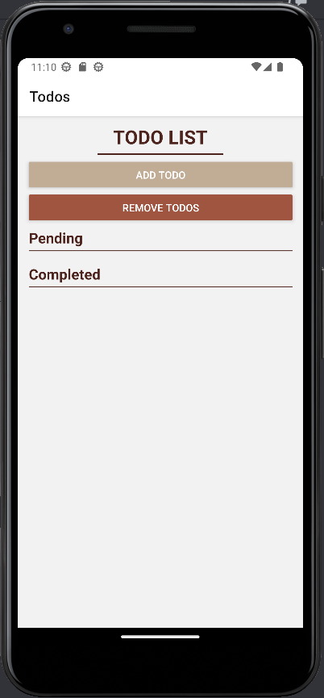
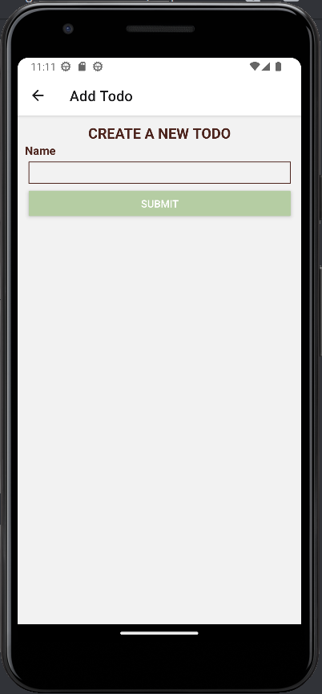
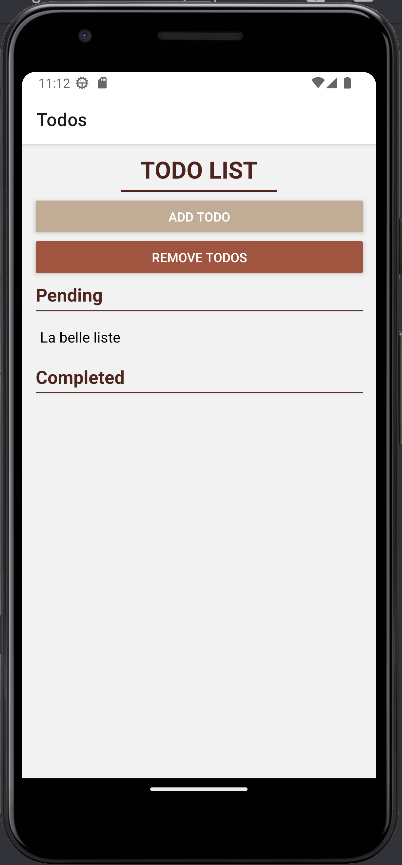
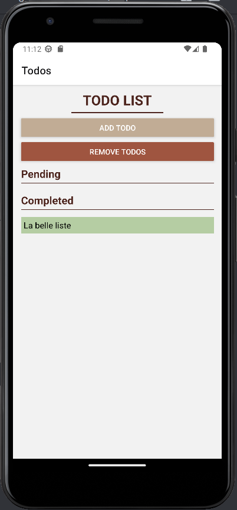

    <h1 align="center">Todo List - Mobile </h1>
    <h4 align="center">A mobile task management application in React Native</h4>

    
    
    

<table>
    <thead>
        <tr>
            <th width="250px">Year</th>
            <th width="250px">Course</th>
            <th width="300px">Subject</th>
            <th width="300px">Project</th>
        </tr>
    </thead>
    <tbody>
        <tr>
          <td align="center">2022-2023</td>
          <td align="center">M2 IWOCS</td>
          <td align="center">Mobile Programming</td>
          <td align="center">Todo List</td>
        </tr>
    </tbody>
</table>

## About

## Result

# Example

Here we have created a task called "la belle liste" which means in "the beautiful list". And that, as an old friend used to say, is the French Touch!
